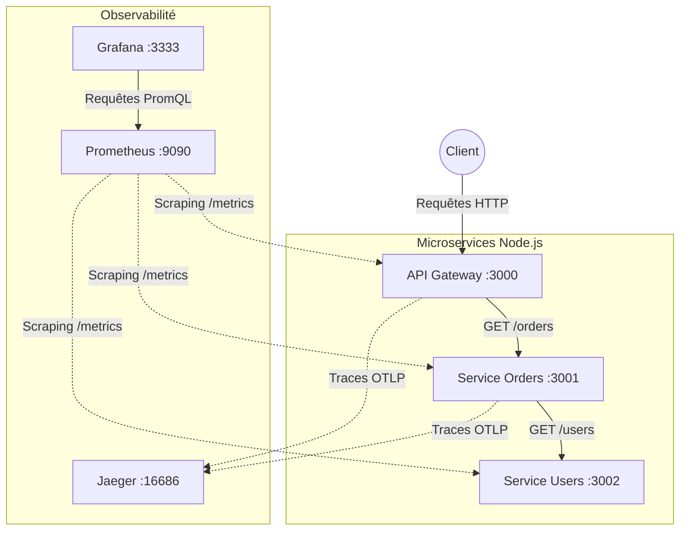
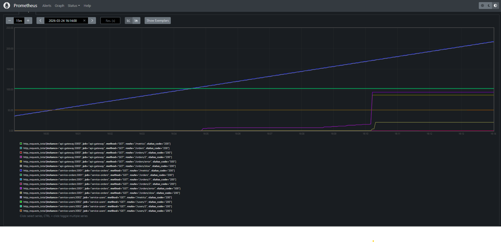

# 📑 Rapport de Travaux Pratiques : Observabilité des Microservices

## Introduction
Ce rapport détaille la mise en place d'une architecture de microservices instrumentée avec une pile complète d'observabilité. L'objectif de ce projet est de rendre le système transparent, mesurable et capable d'alerter en cas de comportements anormaux. La suite logicielle déployée comprend **OpenTelemetry** pour la collecte, **Prometheus** pour les métriques, **Grafana** pour la visualisation, et **Jaeger** pour le traçage distribué.

---

## 1. Architecture de l'Application

L'architecture est composée de trois microservices distincts fonctionnant dans des conteneurs isolés via Docker :
1. **API Gateway (Port 3000)** : Point d'entrée unique qui expose les routes publiques et orchestre les communications.
2. **Service Orders (Port 3001)** : Service métier gérant les commandes.
3. **Service Users (Port 3002)** : Service métier gérant les utilisateurs.

Voici le diagramme représentant le flux de communication et d'observabilité :

Tous les services sont déployés au sein d'un réseau commun Docker nommé `observability`.

---

## 2. Piliers de l'Observabilité mis en place

### 2.1. Traçabilité (Tracing) avec OpenTelemetry et Jaeger
L'API Gateway et le Service Orders ont été instrumentés grâce au SDK **OpenTelemetry** pour Node.js. 
Cette instrumentation intercepte le trafic et injecte un identifiant unique (`traceId`) dans les en-têtes HTTP de chaque requête. Ce contexte est propagé de service en service, permettant de reconstituer le cycle de vie complet d'une requête, d'en mesurer la durée à chaque étape et d'en exporter les "Spans" vers **Jaeger**.

### 2.2. Métriques avec Prometheus
Chaque service génère et expose trois métriques métiers essentielles via la librairie `prom-client` sur la route `/metrics` :
* `http_requests_total` : Un compteur de la volumétrie (par méthode et route).
* `http_request_duration_seconds` : Un histogramme permettant d'analyser la latence et les percentiles de temps de réponse.
* `http_errors_total` : Un compteur pour le taux d'erreur (Code HTTP >= 400).

*Preuve de la collecte directe des métriques brutes par Prometheus lors d'un test de charge :*

### 2.3. Visualisation avec Grafana
Afin de rendre ces données brutes exploitables, un tableau de bord global a été configuré dans **Grafana**. Ce tableau récapitule :
* Le taux de requêtes par seconde.
* Le taux d'erreur par service.
* La latence moyenne globale par service.
* Un histogramme dynamique du trafic par point de terminaison HTTP.

---

## 3. Simulation d'Incident et Diagnostic

Afin de vérifier la robustesse de notre supervision système, nous avons généré deux scénarios de crise ("Chaos Engineering") par l'intermédiaire de scripts de charge massifs :
1. **Lenteur sévère** via des appels ciblés sur le endpoint artificiel `/orders/slow` provoquant un blocage de 3 à 5 secondes.
2. **Cascade d'erreurs HTTP 500** via de multiples appels sur `/orders/error`.

### 3.1 Conséquences visuelles dans Grafana
Lors de l'incident, le tableau de bord a réagi en temps réel :

  
 

On y observe d'immenses bonds statistiques de la latence ainsi que la jauge du `service-orders` et de l'`api-gateway` virant clairement au rouge vif avec de forts pourcentages d'erreurs.

### 3.2 Diagnostic via les traces Jaeger
L'erreur vue dans Grafana indique seulement "qu'il y a un problème global" (Symptôme). Pour trouver la cause racine exacte et détaillée (Diagnostic complet), nous avons inspecté une requête fautive dans Jaeger grâce à la traçabilité partagée :

**Conclusion du diagnostic :** L'arbre de trace démontre l'origine exacte du problème. C'est le service `service-orders` qui renvoie la grande majorité des exceptions, déclenchant un effet domino direct vers l'`api-gateway`. Sans l'usage d'une trace distribuée, identifier l'origine du blocage aveuglément dans un grand parc de microservices prendrait des heures.

---

## 4. Partie Optionnelle : Supervision Automatique (Alertmanager)

Pour parfaire cette architecture, une logique de supervision proactive a été ajoutée. Le fichier central `prometheus.yml` a été enrichi d'un fichier de règles personnalisées (`alert.rules.yml`).

Nous avons défini deux seuils critiques absolus :
* `HighErrorRate` : Dépassement d'un seuil de 5% d'erreurs maintenu sur au moins une minute ininterrompue.
* `HighLatency` : Latence moyenne supérieure à 1.5 seconde.

Lors de la prolongation de notre test de charge et de pannes, Prometheus a logiquement basculé ces alertes en statut rouge "FIRING" après la période d'attente d'une minute :

---

## Conclusion Générale

Ce projet pratique confirme que la mise sur pied d'une trilogie "Monitoring (Métriques), Tracing (Traces), Logging (Journaux)" est un enjeu d’ingénierie et de performance vital dans les environnements distribués. Grâce aux fondations cloud natives manipulées (Docker, Prometheus, Grafana, OpenTelemetry), rendre l'architecture à la fois prédictible, débogable et autonome n'a jamais été aussi transparent.

