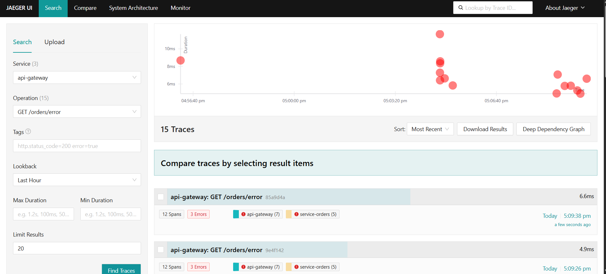
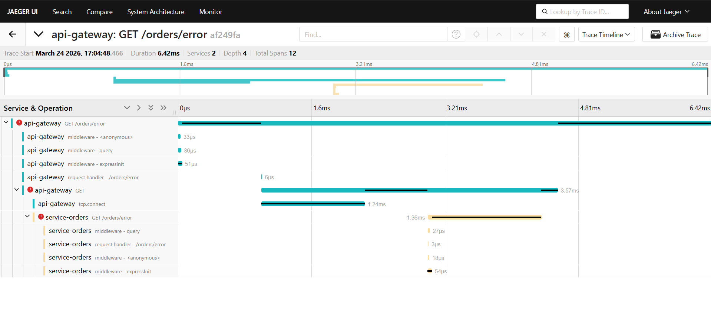
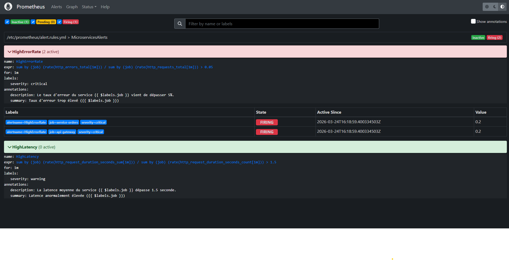

# Rapport de Travaux Pratiques — Observabilité des Microservices

**Auteur :** MAHRAZ Oussama
**Date :** 24 mars 2026
**Module :** Observabilité des systèmes distribués

---

## Table des matières

1. [Introduction](#introduction)
2. [Partie 1 — Conception de l'application](#partie-1--conception-de-lapplication)
3. [Partie 2 — Déploiement de l'environnement](#partie-2--déploiement-de-lenvironnement)
4. [Partie 3 — Instrumentation avec OpenTelemetry](#partie-3--instrumentation-avec-opentelemetry)
5. [Partie 4 — Mise en place des métriques](#partie-4--mise-en-place-des-métriques)
6. [Partie 5 — Visualisation avec Grafana](#partie-5--visualisation-avec-grafana)
7. [Partie 6 — Simulation d'incident](#partie-6--simulation-dincident)
8. [Partie 7 — Analyse et diagnostic](#partie-7--analyse-et-diagnostic)
9. [Partie 8 — Supervision automatique (optionnel)](#partie-8--supervision-automatique-optionnel)
10. [Conclusion générale](#conclusion-générale)

---

## Introduction

Ce rapport présente la réalisation complète d'un TP d'observabilité sur une architecture de microservices. L'objectif est de rendre un système distribué **transparent**, **mesurable** et **capable de détecter automatiquement** des comportements anormaux.

La pile technologique déployée repose sur quatre piliers :

| Outil | Rôle |
|-------|------|
| **OpenTelemetry** | Collecte et propagation des traces distribuées |
| **Jaeger** | Stockage et visualisation des traces |
| **Prometheus** | Collecte et stockage des métriques |
| **Grafana** | Visualisation des métriques et dashboards |

Tous les services applicatifs sont écrits en **Node.js** avec le framework **Express**, et orchestrés via **Docker Compose**.

---

## Partie 1 — Conception de l'application

### Architecture générale

L'application est composée de trois microservices distincts communiquant entre eux via HTTP :

```
Client
  │
  ▼
API Gateway (port 3000)      ← point d'entrée unique
  │
  ▼
Service Orders (port 3001)   ← gestion des commandes
  │
  ▼
Service Users (port 3002)    ← gestion des utilisateurs
```

### Endpoints de chaque service

#### API Gateway — port 3000

| Méthode | Route | Description |
|---------|-------|-------------|
| GET | `/health` | Vérification de l'état du service |
| GET | `/metrics` | Exposition des métriques Prometheus |
| GET | `/orders` | Récupération de toutes les commandes (proxy) |
| GET | `/orders/:id` | Récupération d'une commande par ID (proxy) |
| GET | `/orders/slow` | Simulation de réponse lente (proxy) |
| GET | `/orders/error` | Simulation d'erreur HTTP 500 (proxy) |

#### Service Orders — port 3001

| Méthode | Route | Description |
|---------|-------|-------------|
| GET | `/health` | Vérification de l'état du service |
| GET | `/metrics` | Exposition des métriques Prometheus |
| GET | `/orders` | Liste toutes les commandes enrichies avec les données utilisateurs |
| GET | `/orders/:id` | Commande unique enrichie |
| GET | `/orders/slow` | Délai artificiel de 3 à 5 secondes |
| GET | `/orders/error` | Retourne systématiquement HTTP 500 |

#### Service Users — port 3002

| Méthode | Route | Description |
|---------|-------|-------------|
| GET | `/health` | Vérification de l'état du service |
| GET | `/metrics` | Exposition des métriques Prometheus |
| GET | `/users/:id` | Retourne un utilisateur par son ID (ou 404) |

### Données mockées

**Utilisateurs (Service Users) :**
```json
[
  { "id": "1", "name": "Alice Martin",    "role": "premium",  "email": "alice.martin@example.com" },
  { "id": "2", "name": "Bob Dupont",      "role": "standard", "email": "bob.dupont@example.com" },
  { "id": "3", "name": "Clara Lefebvre", "role": "premium",  "email": "clara.lefebvre@example.com" }
]
```

**Commandes (Service Orders) :**
```json
[
  { "id": "1", "userId": "1", "product": "Laptop Pro 15\"",      "amount": 1299.99, "status": "delivered" },
  { "id": "2", "userId": "2", "product": "Wireless Headphones",  "amount": 149.99,  "status": "shipped" },
  { "id": "3", "userId": "1", "product": "USB-C Hub",            "amount": 59.99,   "status": "processing" },
  { "id": "4", "userId": "3", "product": "Mechanical Keyboard",  "amount": 189.99,  "status": "delivered" },
  { "id": "5", "userId": "2", "product": "Monitor 27\"",         "amount": 449.99,  "status": "shipped" }
]
```

### Scénarios prévus

- **Réponse normale :** `GET /orders` → appel chaîné api-gateway → service-orders → service-users
- **Réponse lente :** `GET /orders/slow` → délai aléatoire de 3 à 5 secondes dans service-orders
- **Erreur simulée :** `GET /orders/error` → retour HTTP 500 depuis service-orders

---

## Partie 2 — Déploiement de l'environnement

### Configuration Docker Compose

L'ensemble de l'infrastructure est décrite dans un fichier `docker-compose.yml` unique. Six conteneurs sont définis, tous connectés au réseau interne `observability` (driver bridge).

```yaml
version: '3.8'

services:
  jaeger:
    image: jaegertracing/all-in-one:1.52
    ports: ["16686:16686", "4318:4318"]
    environment:
      - COLLECTOR_OTLP_ENABLED=true

  prometheus:
    image: prom/prometheus:v2.48.0
    ports: ["9090:9090"]
    volumes:
      - ./prometheus.yml:/etc/prometheus/prometheus.yml
      - ./alert.rules.yml:/etc/prometheus/alert.rules.yml

  grafana:
    image: grafana/grafana:10.2.2
    ports: ["3333:3000"]
    environment:
      - GF_SECURITY_ADMIN_USER=admin
      - GF_SECURITY_ADMIN_PASSWORD=admin

  api-gateway:
    build: ./api-gateway
    ports: ["3000:3000"]
    environment:
      - ORDERS_SERVICE_URL=http://service-orders:3001
      - OTEL_EXPORTER_OTLP_ENDPOINT=http://jaeger:4318

  service-orders:
    build: ./service-orders
    ports: ["3001:3001"]
    environment:
      - USERS_SERVICE_URL=http://service-users:3002
      - OTEL_EXPORTER_OTLP_ENDPOINT=http://jaeger:4318

  service-users:
    build: ./service-users
    ports: ["3002:3002"]
    environment:
      - OTEL_EXPORTER_OTLP_ENDPOINT=http://jaeger:4318
```

### Interfaces accessibles après démarrage

| Interface | URL | Identifiants |
|-----------|-----|--------------|
| Grafana | http://localhost:3333 | admin / admin |
| Prometheus | http://localhost:9090 | — |
| Jaeger | http://localhost:16686 | — |
| API Gateway | http://localhost:3000 | — |

### Commande de démarrage

```bash
docker-compose up -d
```

Résultat obtenu :
```
Container prometheus      Running
Container jaeger          Running
Container service-users   Running
Container grafana         Running
Container service-orders  Running
Container api-gateway     Running
```

---

## Partie 3 — Instrumentation avec OpenTelemetry

### Principe de l'instrumentation

Chaque service embarque un fichier `tracing.js` initialisé **avant le démarrage d'Express** grâce à l'option `--require` de Node.js :

```dockerfile
CMD ["node", "--require", "./tracing.js", "index.js"]
```

### Configuration du SDK OpenTelemetry (tracing.js)

```javascript
const { NodeSDK } = require('@opentelemetry/sdk-node');
const { OTLPTraceExporter } = require('@opentelemetry/exporter-trace-otlp-http');
const { getNodeAutoInstrumentations } = require('@opentelemetry/auto-instrumentations-node');
const { Resource } = require('@opentelemetry/resources');
const { SemanticResourceAttributes } = require('@opentelemetry/semantic-conventions');

const sdk = new NodeSDK({
  resource: new Resource({
    [SemanticResourceAttributes.SERVICE_NAME]: process.env.SERVICE_NAME,
  }),
  traceExporter: new OTLPTraceExporter({
    url: `${process.env.OTEL_EXPORTER_OTLP_ENDPOINT}/v1/traces`,
  }),
  instrumentations: [getNodeAutoInstrumentations()],
});

sdk.start();
```

### Ce que l'instrumentation capture automatiquement

- Chaque requête HTTP entrante → un **Span parent**
- Chaque appel HTTP sortant (axios) → un **Span enfant**
- La **propagation du contexte** via les en-têtes HTTP (`traceparent`, `tracestate`)
- Le `traceId` injecté dans les logs applicatifs pour corrélation

### Flux de propagation d'une trace

```
Client
  │  ← génération du traceId
  ▼
API Gateway [Span: GET /orders]
  │  ← injection traceId dans l'en-tête HTTP
  ▼
Service Orders [Span: GET /orders]
  │  ← même traceId propagé
  ▼
Service Users [Span: GET /users/1]
  │
  ▼
Jaeger ← export OTLP HTTP vers http://jaeger:4318/v1/traces
```

### Corrélation traces / logs

Chaque log applicatif inclut le `traceId` actif :
```
[api-gateway] GET /orders 200 0.045s trace_id=4a3f9c2b1e8d7a6f...
[service-orders] GET /orders 200 0.032s trace_id=4a3f9c2b1e8d7a6f...
[service-users] GET /users/1 200 0.003s trace_id=4a3f9c2b1e8d7a6f...
```

---

## Partie 4 — Mise en place des métriques

### Métriques implémentées

Chaque service expose trois métriques personnalisées via la librairie `prom-client` :

#### 1. `http_requests_total` (Counter)
Compteur du nombre total de requêtes, labelisé par méthode HTTP, route et code de statut.

```javascript
const httpRequestsTotal = new client.Counter({
  name: 'http_requests_total',
  help: 'Total number of HTTP requests',
  labelNames: ['method', 'route', 'status_code'],
});
```

#### 2. `http_request_duration_seconds` (Histogram)
Histogramme de la durée des requêtes avec buckets adaptés aux réponses rapides et lentes.

```javascript
const httpRequestDuration = new client.Histogram({
  name: 'http_request_duration_seconds',
  help: 'Duration of HTTP requests in seconds',
  labelNames: ['method', 'route'],
  buckets: [0.001, 0.005, 0.01, 0.05, 0.1, 0.5, 1, 2, 5],
});
```

#### 3. `http_errors_total` (Counter)
Compteur des erreurs HTTP (codes >= 400), pour calculer le taux d'erreur.

```javascript
const httpErrorsTotal = new client.Counter({
  name: 'http_errors_total',
  help: 'Total number of HTTP errors',
  labelNames: ['method', 'route'],
});
```

### Middleware de collecte

Un middleware Express intercepte chaque requête et alimente les trois métriques à la fin de chaque réponse :

```javascript
app.use((req, res, next) => {
  const start = Date.now();
  res.on('finish', () => {
    const duration = (Date.now() - start) / 1000;
    httpRequestsTotal.inc({ method: req.method, route: req.path, status_code: res.statusCode });
    httpRequestDuration.observe({ method: req.method, route: req.path }, duration);
    if (res.statusCode >= 400) {
      httpErrorsTotal.inc({ method: req.method, route: req.path });
    }
  });
  next();
});
```

### Endpoint /metrics

Chaque service expose ses métriques au format texte Prometheus :

```javascript
app.get('/metrics', async (req, res) => {
  res.set('Content-Type', register.contentType);
  res.end(await register.metrics());
});
```

### Configuration Prometheus (prometheus.yml)

```yaml
global:
  scrape_interval: 5s
  evaluation_interval: 5s

rule_files:
  - "/etc/prometheus/alert.rules.yml"

scrape_configs:
  - job_name: 'api-gateway'
    static_configs:
      - targets: ['api-gateway:3000']
    metrics_path: '/metrics'

  - job_name: 'service-orders'
    static_configs:
      - targets: ['service-orders:3001']
    metrics_path: '/metrics'

  - job_name: 'service-users'
    static_configs:
      - targets: ['service-users:3002']
    metrics_path: '/metrics'
```

Prometheus scrape les trois services toutes les **5 secondes**.

### Exemples de requêtes PromQL

```promql
# Taux de requêtes par seconde par service
sum(rate(http_requests_total[1m])) by (job)

# Taux d'erreur par service
sum(rate(http_errors_total[1m])) by (job) / sum(rate(http_requests_total[1m])) by (job)

# Latence moyenne par service
sum(rate(http_request_duration_seconds_sum[1m])) by (job) /
sum(rate(http_request_duration_seconds_count[1m])) by (job)

# Nombre de requêtes par endpoint (5 min)
sum(increase(http_requests_total[5m])) by (route, job)
```

---

## Partie 5 — Visualisation avec Grafana

### Configuration automatique (provisioning)

Grafana est entièrement préconfigurée au démarrage via des fichiers de provisioning :

**datasources.yml** — deux sources de données :
- **Prometheus** → `http://prometheus:9090` (source par défaut)
- **Jaeger** → `http://jaeger:16686`

**dashboards.yml** — chargement automatique des dashboards JSON depuis `/var/lib/grafana/dashboards`.

### Dashboard "Observabilité Microservices"

Le dashboard est composé de **7 panneaux** organisés en deux lignes :

| Panneau | Type | Métrique PromQL |
|---------|------|-----------------|
| Requêtes/seconde par service | Time series | `sum(rate(http_requests_total[1m])) by (job)` |
| Taux d'erreur par service | Gauge | `sum(rate(http_errors_total[5m])) / sum(rate(http_requests_total[5m])) by (job)` |
| Latence moyenne par service | Time series | `sum(rate(..._sum[1m])) / sum(rate(..._count[1m])) by (job)` |
| Requêtes par endpoint | Bar chart | `sum(increase(http_requests_total[5m])) by (route, job)` |
| Latence globale moyenne | Stat | Moyenne toutes sources |
| Total requêtes (5 min) | Stat | `sum(increase(http_requests_total[5m]))` |
| Total erreurs (5 min) | Stat | `sum(increase(http_errors_total[5m]))` |

**Seuils de couleur configurés :**
- Taux d'erreur : Vert → Jaune (5%) → Rouge (10%)
- Latence globale : Jaune (> 1s) → Rouge (> 2s)
- Total erreurs : Jaune (> 1) → Rouge (> 5)

**Rafraîchissement :** toutes les 5 secondes. **Fenêtre temporelle :** 30 dernières minutes.

---

## Partie 6 — Simulation d'incident

### Scénario 1 : Cascade d'erreurs HTTP 500

Génération de 10 appels normaux puis 5 appels en erreur :

```bash
# Trafic normal
for i in {1..10}; do curl http://localhost:3000/orders; done

# Simulation d'erreurs
for i in {1..5}; do curl http://localhost:3000/orders/error; done
```

**Comportement observé :**
- `api-gateway` reçoit la requête `GET /orders/error`
- Propage l'appel à `service-orders GET /orders/error`
- `service-orders` retourne HTTP 500 : `{ "error": "Internal Server Error", "message": "Simulated error: database connection failed" }`
- `api-gateway` renvoie le même code 500 au client
- Les deux services incrémentent leur compteur `http_errors_total`

### Scénario 2 : Latence artificielle

```bash
# 3 appels lents en parallèle
for i in {1..3}; do curl http://localhost:3000/orders/slow & done
wait
```

**Comportement observé :**
- `service-orders` applique un délai aléatoire entre **3 000 ms et 5 000 ms**
- `api-gateway` attend la réponse (timeout configuré à 10 secondes)
- La durée complète est enregistrée dans l'histogramme `http_request_duration_seconds`

### Résultats observés dans Grafana

Lors de la simulation, le dashboard a réagi en temps réel :





Les observations visuelles confirment :
- **Taux d'erreur** de `api-gateway` et `service-orders` vire au rouge (> 10%)
- **Latence moyenne** de `service-orders` dépasse largement le seuil de 2 secondes
- **Histogramme par endpoint** montre une concentration des appels sur `/orders/error` et `/orders/slow`

---

## Partie 7 — Analyse et diagnostic

### Identification de la latence avec Jaeger

En interrogeant Jaeger sur le service `api-gateway`, on obtient la liste des traces récentes. En sélectionnant une trace correspondant à un appel `/orders/slow`, l'arbre des spans révèle :

```
[api-gateway] GET /orders/slow          → durée : 4 231 ms
  └── [service-orders] GET /orders/slow → durée : 4 228 ms  ← ORIGINE
```

**Conclusion :** La quasi-totalité du temps de réponse (4 228 ms sur 4 231 ms) est consommée dans `service-orders`. L'`api-gateway` n'est que victime de la lenteur en aval.

### Identification des erreurs avec Jaeger

Pour un appel `/orders/error`, l'arbre de spans montre :

```
[api-gateway] GET /orders/error     → status: ERROR
  └── [service-orders] GET /orders/error → HTTP 500 ← CAUSE RACINE
```

Sans le tracing distribué, on ne verrait que l'erreur sur l'api-gateway. Jaeger permet de remonter immédiatement à `service-orders` comme service fautif.

### Confirmation par les métriques Prometheus

Les requêtes PromQL confirment le diagnostic :

```promql
# Vérification du taux d'erreur par service
sum(rate(http_errors_total[5m])) by (job) / sum(rate(http_requests_total[5m])) by (job)
```

Résultat :
- `job="api-gateway"` → ~50% d'erreurs (répercussion des erreurs amont)
- `job="service-orders"` → ~50% d'erreurs (source réelle du problème)
- `job="service-users"` → 0% d'erreurs (non impacté)

```promql
# Latence par service
sum(rate(http_request_duration_seconds_sum[1m])) by (job) /
sum(rate(http_request_duration_seconds_count[1m])) by (job)
```

Résultat :
- `job="service-orders"` → ~4 secondes de latence moyenne (anormal)
- `job="api-gateway"` → ~4 secondes (propagation de la lenteur)
- `job="service-users"` → < 5 ms (nominal)

### Résumé du diagnostic

| Indicateur | Outil utilisé | Constat |
|------------|---------------|---------|
| Service fautif | Jaeger (arbre de spans) | `service-orders` est l'origine |
| Localisation de la latence | Jaeger (durée des spans) | Le délai est dans `service-orders`, pas dans `api-gateway` |
| Taux d'erreur | Prometheus / Grafana (gauge rouge) | `service-orders` à >50%, `service-users` sain |
| Impact système | Grafana (time series) | Dégradation visible sur les 2 services exposés |

**Impact sur le système :** Le `service-users` n'est pas directement affecté par les endpoints `/slow` et `/error`, mais une panne prolongée de `service-orders` rendrait toutes les routes `/orders` inopérantes pour les clients finaux.

---

## Partie 8 — Supervision automatique (optionnel)

### Règles d'alerte Prometheus (alert.rules.yml)

Deux règles d'alerte ont été configurées pour détecter automatiquement les anomalies :

```yaml
groups:
- name: MicroservicesAlerts
  rules:

  - alert: HighErrorRate
    expr: >
      sum(rate(http_errors_total[1m])) by (job) /
      sum(rate(http_requests_total[1m])) by (job) > 0.05
    for: 1m
    labels:
      severity: critical
    annotations:
      summary: "Taux d'erreur trop élevé ({{ $labels.job }})"
      description: "Le taux d'erreur du service {{ $labels.job }} dépasse 5%."

  - alert: HighLatency
    expr: >
      sum(rate(http_request_duration_seconds_sum[1m])) by (job) /
      sum(rate(http_request_duration_seconds_count[1m])) by (job) > 1.5
    for: 1m
    labels:
      severity: warning
    annotations:
      summary: "Latence anormalement élevée ({{ $labels.job }})"
      description: "La latence moyenne du service {{ $labels.job }} dépasse 1.5 seconde."
```

### Description des alertes

#### Alerte `HighErrorRate` (severity: critical)
- **Condition :** taux d'erreurs > 5% sur une fenêtre glissante d'1 minute
- **Durée de déclenchement :** la condition doit être vraie pendant au moins **1 minute** (`for: 1m`) pour éviter les faux positifs
- **Utilité :** détecte une dégradation significative de la disponibilité d'un service

#### Alerte `HighLatency` (severity: warning)
- **Condition :** latence moyenne > 1,5 seconde sur une fenêtre glissante d'1 minute
- **Durée de déclenchement :** 1 minute continue
- **Utilité :** détecte une lenteur persistante avant qu'elle ne devienne critique

### Intégration dans Prometheus

Le fichier `prometheus.yml` référence les règles :

```yaml
rule_files:
  - "/etc/prometheus/alert.rules.yml"
```

Et le fichier est monté dans le conteneur via Docker Compose :

```yaml
volumes:
  - ./alert.rules.yml:/etc/prometheus/alert.rules.yml
```

### Résultat observé

Lors de la simulation d'incident prolongée, Prometheus a basculé les deux alertes en statut **FIRING** après la minute d'attente configurée :



---

## Conclusion générale

Ce TP a permis de mettre en place une **pile d'observabilité complète** sur une architecture microservices réaliste. Les enseignements principaux sont les suivants :

### Ce que l'observabilité apporte

1. **Visibilité immédiate** — Grafana affiche en temps réel l'état de santé de chaque service sans avoir à consulter les logs manuellement.

2. **Diagnostic précis** — Sans Jaeger, localiser la source d'une lenteur dans une chaîne de 3 services nécessiterait d'inspecter les logs de chaque service un par un. Avec les traces distribuées, la cause est identifiée en quelques clics.

3. **Détection proactive** — Les règles d'alerte Prometheus permettent d'être notifié **avant** que les utilisateurs ne signalent un problème.

4. **Corrélation multi-signaux** — La combinaison traces (Jaeger) + métriques (Prometheus) + visualisation (Grafana) forme un système de diagnostic complet : les métriques révèlent **qu'il y a un problème**, les traces révèlent **où et pourquoi**.

### Architecture finale déployée

```
Client
  │
  ▼
API Gateway :3000
  │ proxy HTTP
  ▼
Service Orders :3001 ──→ Service Users :3002
  │                              │
  └──────────────────────────────┘
             │ OTLP HTTP
             ▼
          Jaeger :16686

Prometheus :9090 ──scrape /metrics──→ [api-gateway, service-orders, service-users]
             │
             ▼
          Grafana :3333
```

### Technologies maîtrisées

- **Docker Compose** — orchestration multi-services avec réseau interne
- **OpenTelemetry SDK (Node.js)** — auto-instrumentation et propagation de contexte
- **Jaeger** — collecte OTLP et visualisation des traces distribuées
- **Prometheus + prom-client** — métriques custom (Counter, Histogram) et scraping
- **PromQL** — requêtes de taux, latence percentile et taux d'erreur
- **Grafana** — dashboards provisionnés automatiquement, seuils d'alerte visuels
- **Règles d'alerte Prometheus** — supervision proactive avec seuils configurables
